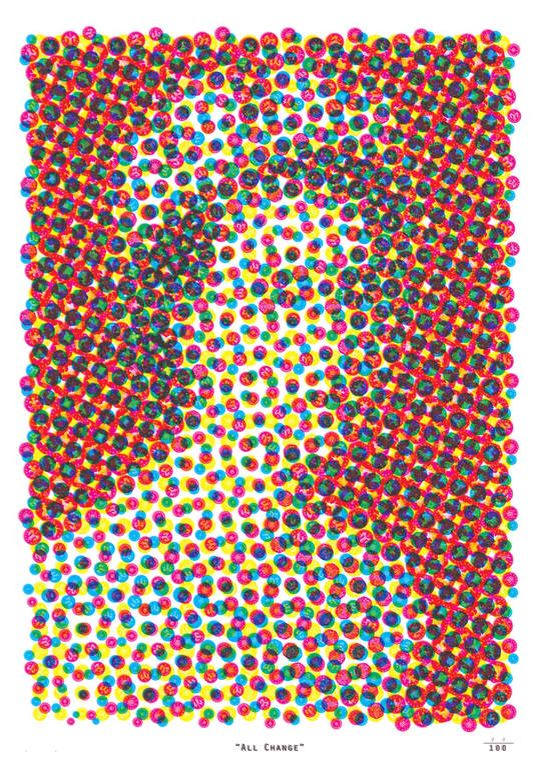
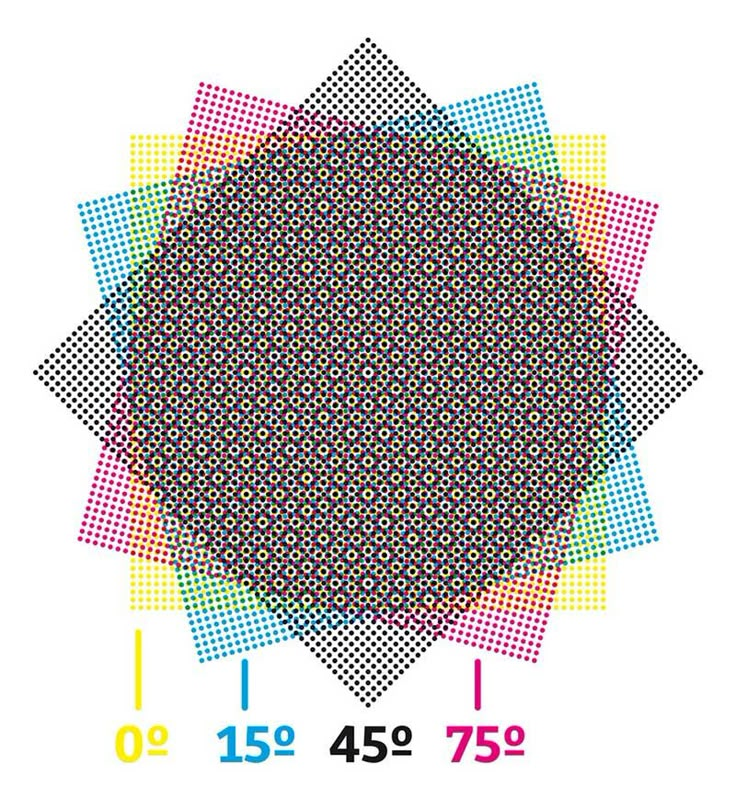
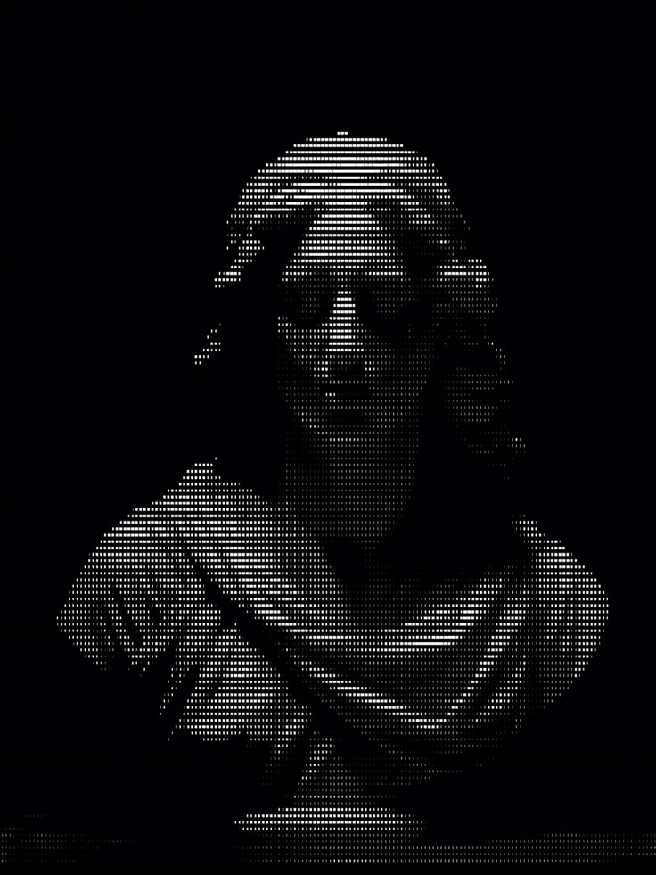

## Creative Coding + AI II: Custom Pixel

## Retro Comic Statue Filter

### Introduction

This project takes a masked statue image and:

- Paints the statue in clustered CMY “Ben-Day” dots whose density and colour are driven by gamma-corrected brightness.

- Fills the background with a repeating “brick + hatch” pattern that echoes letterpress and analogue film errors.

- Overlays a fine black halftone grid on the statue for extra texture.

## Inspiration
*I sourced these images from Pinterest, I could not find the original artists*

## Design Process

I drew on photos of classical statues I shot during my travels in Greece and Italy, choosing their timeless forms because their strong, sculptural outlines would translate clearly through whatever filter I applied.- I experimented with classic photo filters like posterize, blur, mosaic, and random colour mappings but the results felt aimless and lacked cohesion. I realized I needed a strong, unifying visual theme to guide the design.- I drew inspiration from vintage comics and Risograph prints, settling on a restrained cyan-magenta-yellow palette and using evenly spaced dot clusters to handle mid-tone shading.

Gamma-Corrected Brightness:
- Applied a γ>1 curve to push midtones darker and highlights brighter.
- Mapped b < 30 → 3 dots, 30–60 → 2 dots, 60–85 → 1 dot.

I mapped the darkest areas to magenta, midtones to cyan, and highlights to yellow. I had to play around with the boundaries for each colour. Initially, not enough magenta was showing up. This meant that I had to adjust the original pixData to add contrast so that the tones were more dramatic. Hence why I adjusted using Gamma.

I was inspired by the fact that during their time, these statues would have been painted in vibrant colours. I wanted to recolour them, but with a modern twist. 

I explored various looks: from Moiré interference patterns to glitchy scan‐line effects and high-contrast duotone overlays but ultimately landed on a grid of repeating “bricks” for the background. Each brick’s width is driven by the underlying pixel brightness, so darker areas yield wider blocks, and I overlaid tiny, randomly rotated hatch lines (at ±22.5°) to give everything a subtle, hand-printed texture reminiscent of analogue printmaking. I stumbled upon this, but I liked the way it looked like an old black and white TV static texture.

I finished by overlaying a precise grid of black dots (every 8px and sized according to local brightness) across the statue.